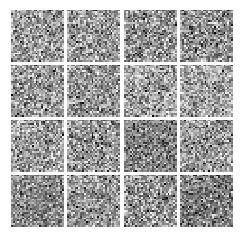
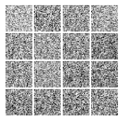
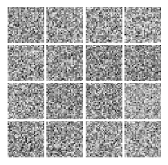
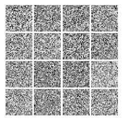
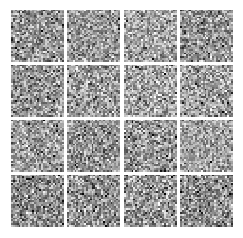

# Baby GANs

GANs are Generative Adversarial Networks. This repository contains my experiments with GANs.

## Notebooks

- [Vanilla GAN](http://nbviewer.jupyter.org/github/suriyadeepan/baby-gans/blob/f1d77810addbc5734e4227e2fc1463ee8d65b7fd/simple-gan.ipynb)

- [Conditional GAN](http://nbviewer.jupyter.org/github/suriyadeepan/baby-gans/blob/8b8ddb1ff975ac74f38e44d77fdc1c45884cffd3/cgan.ipynb)

## Resources

1. [GANs in Tensorflow](http://wiseodd.github.io/techblog/2016/09/17/gan-tensorflow/)
2. [GAN Hacks](https://github.com/soumith/ganhacks)
